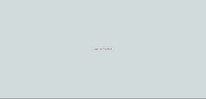

# WhatsappClone
Clone do whatsapp web criado com o objetivo de expandir meus horizontes em reactJS.

A autenticacao do usuário é feita via login no facebook.

O back-end foi construído utilizando firebase. 

**Toda estrutura do projeto está modularizada para que o back-end possa ser alterado posteriormente com as mudanças sendo feitas no arquivo src/Api.js.**

dependencias utilizadas no projeto:
    
    "dependencies": {
    "@material-ui/core": "^4.11.2",
    "@material-ui/icons": "^4.11.2",
    "@testing-library/jest-dom": "^5.11.6",
    "@testing-library/react": "^11.2.2",
    "@testing-library/user-event": "^12.6.0",
    "emoji-picker-react": "^3.2.4",
    "firebase": "^8.2.1",
    "react": "^17.0.1",
    "react-dom": "^17.0.1",
    "react-scripts": "4.0.1",
    "web-vitals": "^0.2.4"
  },
